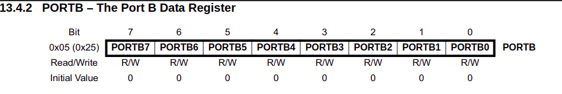
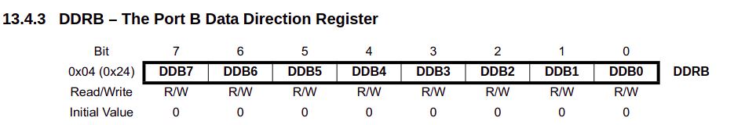
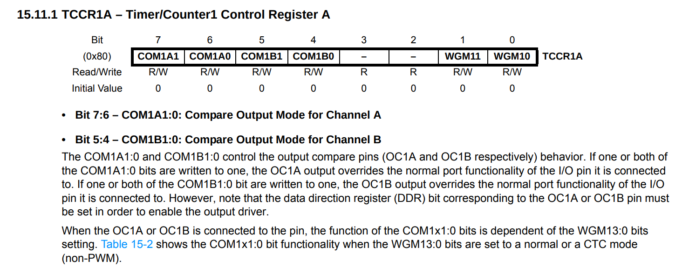
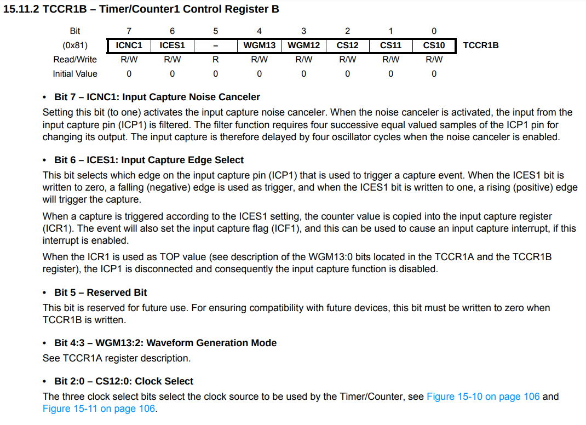
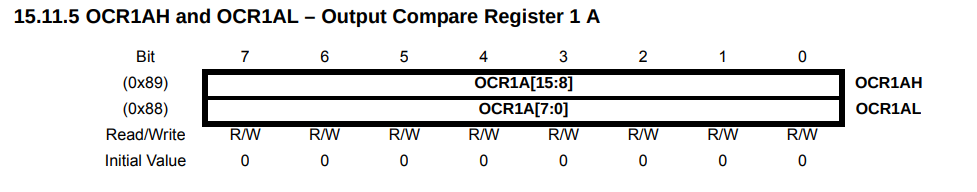
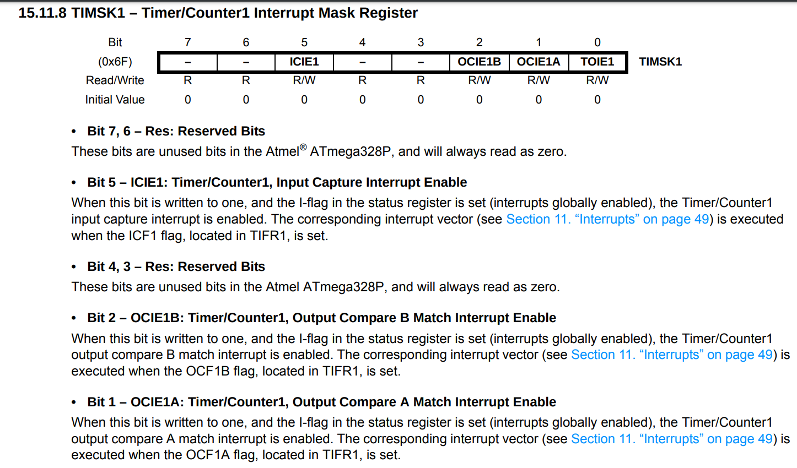
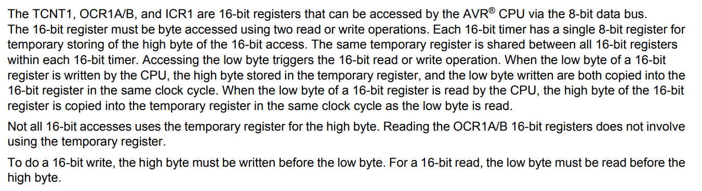
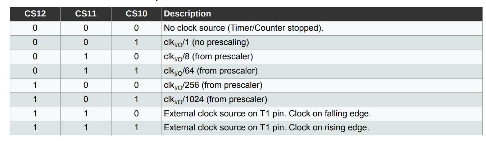
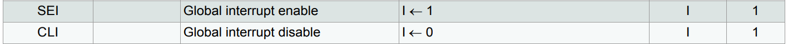
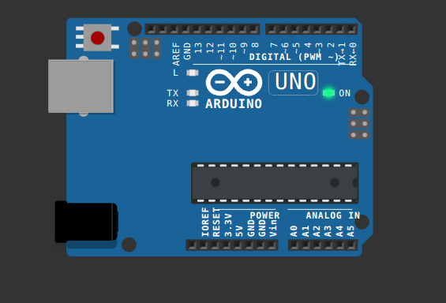

# Blynk

This specific example demonstrates how to blink an LED connected to pin 13 (PORTB5) of the Atmega328p by configuring and utilizing Timer1 and its interrupt capabilities. 

## Why Bare Metal?

- **Deeper Understanding**  
    - You'll gain a much clearer picture of how microcontrollers work at a fundamental level.
- **Efficiency**  
    - By writing code tailored to your exact needs, you can often achieve smaller code size and faster execution.
- **Portability** 
    - Your code is less reliant on platform-specific libraries, making it potentially more portable.

## Prerequisites

- **AVR-GCC Toolchain**  
    - The standard toolset for compiling and working with AVR microcontrollers. 
    - Download and install it from [https://gcc.gnu.org/wiki/avr-gcc](https://gcc.gnu.org/wiki/avr-gcc)
- **avrdude** 
    - A utility for programming AVR microcontrollers. It usually comes bundled with AVR-GCC or you can get it from [https://www.nongnu.org/avrdude/](https://www.nongnu.org/avrdude/)
- **Code Editor** 
    - Any editor of your choice (e.g., VS Code, Sublime Text, Atom).
- **Arduino Uno (or Wokwi Simulator)** 
    - We'll use the Uno as our development board for simplicity.
> [!TIP]
>  You can find how to set up the Wokwi Simulator in the [here](https://docs.wokwi.com/vscode/project-config)

## Hardware Setup

- No additional hardware is required for this example.

## Code Breakdown [blynk.c](Blynk_C/blynk.c)

Let's break down the core components of the `blynk.c` code:

**1. Register Definitions:**

   ```c
   #define PORTB *((volatile unsigned char *)0x25)
   #define DDRB *((volatile unsigned char *)0x24)
   // ... other register definitions
   ```

- **Macros** 
    - `define PORTB` creates a macro named PORTB. Whenever the compiler encounters PORTB, it replaces it with the code `*((volatile unsigned char *)0x25)`, which effectively lets us work directly with the register.
- **Pointers**
    - `(volatile unsigned char *)0x25` creates a pointer to the memory address 0x25. 
    - We use `unsigned char *` because each register usually holds 8 bits (1 byte). 
- **Volatile Keyword**
    The `volatile` keyword tells the compiler not to optimize reads/writes to this address, as its value can change due to external hardware factors.

    - You can see the output of the preprocessor by running `make preprocess` in the terminal(There will be a file [build/output/blynk.i](Blynk_C/build/output/blynk.i)).

- **Memory Addresses** 
- The hexadecimal values (e.g., `0x25`) represent the memory addresses of these registers, as defined in the Atmega328p datasheet as follow.
   - PORTB (address 0x25) controls the state of the pins on Port B, which includes digital pins 8 to 13 on the Arduino Uno.
    - In here we are using PORTB5 which is the pin 13 on the Arduino Uno.
    
    _Image Source: [Atmega328p Datasheet](http://ww1.microchip.com/downloads/en/DeviceDoc/Atmel-7810-Automotive-Microcontrollers-ATmega328P_Datasheet.pdf) Page 72_
    - DDRB (address 0x24) configures the direction (input/output) of those pins.
    - In here we are using DDRB5 which is the pin 13 on the Arduino Uno.
    
    _Image Source: [Atmega328p Datasheet](http://ww1.microchip.com/downloads/en/DeviceDoc/Atmel-7810-Automotive-Microcontrollers-ATmega328P_Datasheet.pdf) Page 72_
    - TCCR1A (address 0x80) and TCCR1B (address 0x81) are the Timer1 control registers where we configure the timer.
    
    _Image Source: [Atmega328p Datasheet](http://ww1.microchip.com/downloads/en/DeviceDoc/Atmel-7810-Automotive-Microcontrollers-ATmega328P_Datasheet.pdf) Page 108_
    
    _Image Source: [Atmega328p Datasheet](http://ww1.microchip.com/downloads/en/DeviceDoc/Atmel-7810-Automotive-Microcontrollers-ATmega328P_Datasheet.pdf) Page 110_
    - OCR1AH (address 0x89) and OCR1AL (address 0x88) are the high and low bytes of the Output Compare Register A, where we set the compare value for Timer1.
    
    _Image Source: [Atmega328p Datasheet](http://ww1.microchip.com/downloads/en/DeviceDoc/Atmel-7810-Automotive-Microcontrollers-ATmega328P_Datasheet.pdf) Page 91_

    - TIMSK1 (address 0x6F) is the Timer1 Interrupt Mask Register, where we enable the Timer1 Compare Match A interrupt.
    


    - TIFR1 (address 0x36) is the Timer1 Interrupt Flag Register, where we clear the Timer1 Compare Match A interrupt flag.
    - TCNT1 (address 0x84) is the Timer1 Counter Register, which holds the current count value of Timer1.

- **Volatile Keyword:**  The `volatile` keyword is essential. It tells the compiler that the values stored at these memory addresses might change unexpectedly (due to hardware interactions), preventing unwanted compiler optimizations.

**2. Timer1 Compare Match A Interrupt Service Routine (ISR)**

   ```c
   void __vector_11(void) __attribute__((signal, used, externally_visible));
   void __vector_11(void)
   {
       PORTB ^= (1 << PORTB5); // Toggle PORTB5
       TIFR1 ^= (1 << OCF1A);  // Clear Timer1 Compare Match A Flag
   }
   ```

- **Interrupt Vectors**
    - The `__vector_11` function is associated with a specific interrupt (Timer/Counter1 Compare Match A) in the Atmega328p's interrupt vector table.
    - The `__attribute__((signal, used, externally_visible))` directive tells the compiler to generate the ISR code and make it externally visible.
    
    _Image Source: [Atmega328p Datasheet](http://ww1.microchip.com/downloads/en/DeviceDoc/Atmel-7810-Automotive-Microcontrollers-ATmega328P_Datasheet.pdf) Page 49  
    (In here vector is represented 12 since vector table explained in here starts with 1)_
- **How Interrupts Work**    
    - When Timer1's count matches a pre-set value, it raises an interrupt flag. 
    - The microcontroller then jumps to the corresponding ISR (`__vector_11` in this case) to handle the event.
- **Toggling the LED**
    - `(1 << PORTB5)` creates a bitmask with a single '1' in the position representing PORTB5 (pin 13), which is the 5th bit.
    - `PORTB ^=(1 << PORTB5);` performs a bitwise XOR operation. This toggles the state of PORTB5 - if it was '0', it becomes '1' (LED on) and vice versa.

- **Clearing the Interrupt Flag** 
    - `TIFR1 ^= (1 << OCF1A);` clears the Timer1 interrupt flag so that the microcontroller knows the interrupt has been serviced and it can generate the next interrupt when the timer matches the compare value again


**3. Main Function (main)**

   ```c
   int main()
   {
       // ... (Timer1 Configuration) 

       DDRB |= (1 << DDRB5); // Set PORTB5 as output

       // ... (Interrupt Setup)

       PORTB |= (1 << PORTB5); // Set PORTB5 to High initially

       while (1); // Infinite loop
   }
   ```

   - **Timer1 Configuration** (See explanation below) 
        - We set up Timer1 to generate interrupts at regular intervals to control the blinking rate.
   - **Pin Direction** 
        - `DDRB |= (1 << DDRB5); // 00100000`  sets PORTB5 (pin 13) as an output, allowing us to control the LED.
   - **Interrupt Setup** (See explanation below) 
        - We enable the Timer1 Compare Match A interrupt.
   - **Initial LED State** 
        - `PORTB |= (1 << PORTB5); // 00100000 ` sets PORTB5 to high initially, turning on the LED.
   - **Infinite Loop** 
        - The `while (1);` statement keeps the program running indefinitely. 
        - The actual LED blinking is handled in the background by the timer interrupt.

**4. Timer1 Configuration**

   ```c
       TCNT1 = 0;  
       TCCR1A = 0; 
       TCCR1B = 0; 

       OCR1AH = 15624 >> 8; 
       OCR1AL = 15624 & 0xFF; 

       TIFR1 ^= (1 << OCF1A);

       TCCR1B |= (1 << CS12); 
   ```

- **Timer Initialization** 
    - The first three lines initialize the timer counter (TCNT1) and control registers (TCCR1A, TCCR1B) to their default values.

- **Setting the Compare Value**
    `OCR1AL = 15624 & 0xFF;` and `OCR1AH = 15624 >> 8;` load the 16-bit value 15624 into the OCR1A (Output Compare Register A). 
    - Timer1 will generate an interrupt when its counter (TCNT1) matches this value.
    
    _Image Source: [Atmega328p Datasheet](http://ww1.microchip.com/downloads/en/DeviceDoc/Atmel-7810-Automotive-Microcontrollers-ATmega328P_Datasheet.pdf) Page 91_

- **Prescaler** 
    - `TCCR1B |= (1 << CS12);` sets the clock prescaler for Timer1 to 256 (using the CS12 bit in TCCR1B). 
    - The prescaler divides the system clock frequency (usually 16 MHz on an Arduino Uno) by 256, effectively slowing down the timer.
    
    _Image Source: [Atmega328p Datasheet](http://ww1.microchip.com/downloads/en/DeviceDoc/Atmel-7810-Automotive-Microcontrollers-ATmega328P_Datasheet.pdf) Page 110_

- **Calculating Blinking Frequency** 
    - The combination of the compare value (15624) and the prescaler (256) determines how often the LED blinks. 
    - With a 16 MHz clock and a prescaler of 256, the timer increments approximately every 16 microseconds (16 MHz / 256 = 62.5 kHz). 
    - It takes about 1 second (15624 counts * 16 µs/count ≈ 1 second) for the timer to overflow and generate an interrupt, resulting in the LED blinking approximately once per second.

**5. Interrupt Setup**

   ```c
       __asm__ __volatile__("cli" ::: "memory"); // Disable Interrupts

       TIMSK1 = (1 << OCIE1A); // Enable Timer1 Compare Match A Interrupt

       __asm__ __volatile__("sei" ::: "memory"); // Enable Interrupts
   ```
   - **Critical Section** 
        - We briefly disable global interrupts (`cli`) to prevent any interruptions while we configure the specific interrupt we need.
   
   - **Enabling the Interrupt:** 
        -  `TIMSK1 = (1 << OCIE1A);` enables the Timer1 Compare Match A interrupt. 
    
    
- **Re-enabling Interrupts**
    - `sei` re-enables global interrupts, allowing the microcontroller to respond to the Timer1 interrupt.
    
## Makefile Explained

A Makefile is a handy tool for automating the build process:

```makefile
# Compiler : avr-gcc
CC = avr-gcc

# nm : avr-nm
NM = avr-nm

# Microcontroller : atmega328p
MMCU = atmega328p

# File name : blink
FILE = blynk

# Files assosiated
# - $(SOURCE) : C source file
# - $(PREPROCCESSED) : Preprocessed file
# - $(ASSEMBLY) : Assembly file
# - $(OBJECT) : Object file
# - $(HEX) : Hex file
SOURCE = $(FILE).c
PREPROCCESSED = $(FILE).i
ASSEMBLY = $(FILE).s
OBJECT = $(FILE).o
HEX = $(FILE).hex

# Build directory
BUILD = build
# Output directory
OUTPUT = $(BUILD)/output

# Flags
# - $(PRE_FLAGS) : Preprocessing flags
PRE_FLAGS = -mmcu=$(MMCU) -Werror -E $(BUILD)/$(SOURCE) -o $(OUTPUT)/$(PREPROCCESSED)

# Compiler flags
COMP_FLAGS = -mmcu=$(MMCU) -Werror -S $(BUILD)/$(SOURCE) -o $(OUTPUT)/$(ASSEMBLY)

# Assembler flags
ASM_FLAGS = -mmcu=$(MMCU) -Werror -c $(OUTPUT)/$(ASSEMBLY) -o $(OUTPUT)/$(OBJECT)


# 
initializeDir:
	mkdir -p $(OUTPUT)

copyFiles:
	cp $(SOURCE) $(BUILD)/$(SOURCE)

preprocess: initializeDir copyFiles
	$(CC) $(PRE_FLAGS)

compile :
	$(CC) $(COMP_FLAGS)

assemble :
	$(CC) $(ASM_FLAGS)
	
build : initializeDir copyFiles preprocess compile assemble
	$(CC) -mmcu=$(MMCU) -o $(OUTPUT)/$(OBJECT) $(BUILD)/$(SOURCE) -Wl,-Map=$(OUTPUT)/$(FILE).map
	$(NM) -n $(OUTPUT)/$(OBJECT) > $(OUTPUT)/$(FILE).nm
	avr-objcopy -O ihex -j .text -j .data $(OUTPUT)/$(OBJECT) $(OUTPUT)/$(HEX)
	avr-size --format=avr --mcu=$(MMCU) $(OUTPUT)/$(OBJECT) > $(OUTPUT)/$(FILE)-size.txt

flash:	
	avrdude -C /etc/avrdude.conf -v -p $(MMCU) -c arduino -P /dev/ttyACM0 -b 115200 -D -U flash:w:$(OUTPUT)/$(HEX)

all : initializeDir copyFiles  preprocess compile assemble build


clean:
	rm -rf build

```

- **Variables** 
    - The Makefile starts by defining variables (e.g., `CC`, `MMCU`, `FILE`) for the compiler, microcontroller type, and project file name, making it easy to modify these settings.
- **Targets:**  
    - The `initializeDir`, `copyFiles`, `preprocess`, `compile`, `assemble`, and `build` targets define different stages of the compilation and linking process. 
- **flash Target:**  
    - This target is essential for uploading the compiled code to your Arduino Uno. It uses `avrdude` and specifies the programmer type (`-c arduino`), port (`-P /dev/ttyACM0`), and the compiled hex file (`$(OUTPUT)/$(HEX)`).
- **all Target:** 
    - This is a common target that executes multiple targets (in this case, `initializeDir`, `copyFiles`, `preprocess`, `compile`, `assemble`, and `build`) in the correct sequence to build the entire project.
- **clean Target:** 
    - A useful target that removes the build directory and its contents, cleaning up the project.

## Building and Flashing the Project

1. **Open a Terminal** - Navigate to the project directory.
2. **Build** - Type `make all` to compile and link your code. 
3. **Flash** - Type `make flash` to upload the compiled code to your Arduino Uno. You might need to adjust the `-P` option in the Makefile to match the serial port of your Uno.

## Observation

If everything is set up correctly, you should see the LED connected to pin 13 of your Arduino Uno blinking at approximately 1-second intervals.

## Simulation

You can also simulate the code using the Wokwi Simulator.
If you have set up the Wokwi Simulator, first, you need to compile the code using `make all` and then got to the diagram.json and run simulation.


## Conclusion

Congratulations! You've successfully blinked an LED on an Arduino Uno using bare-metal programming techniques. 

## Further Exploration
- Try modifying the compare value and prescaler to change the blinking frequency.
- Experiment with other timer modes and interrupts to create more complex behaviors.
