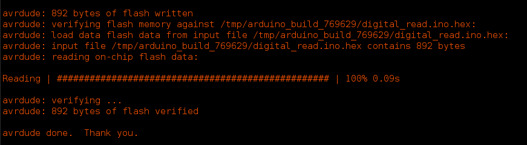
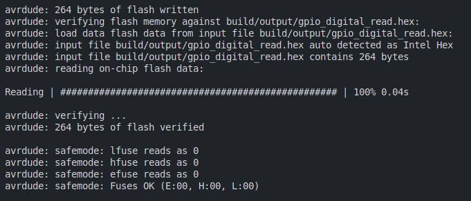

# GPIO Digital Read

This example demonstrates how to use the GPIO Digital Read block to read a digital value from a GPIO pin on an Arduino Uno (Atmega328p) using pure C programming without the Arduino libraries. The code utilizes the AVR-GCC toolchain for compilation and flashing the firmware onto the microcontroller.

## Project Structure

```
├── gpio_digital_read.c          # Main C source file
├── makefile                     # Makefile for building the project
└── README.md                    # Project documentation
```

## Prerequisites

- [AVR-GCC toolchain](https://gcc.gnu.org/wiki/avr-gcc)
- [avrdude](https://www.nongnu.org/avrdude/)
- Arduino Uno (Atmega328p)

## Code Overview (gpio_digital_read.c)

The code leverages direct register access to read a digital value from pin 12 (PORTB4) of the Arduino Uno. Let's break down the key components:

1. **Register Definitions**

    ```c
    #define PORTB *((volatile unsigned char *)0x25)
    #define PORTD *((volatile unsigned char *)0x2B)
    #define DDRB *((volatile unsigned char *)0x24)
    #define DDRD *((volatile unsigned char *)0x2A)

    #define PIND *((volatile unsigned char *)0x29)
    ```

- We use preprocessor directives (`#define`) to create human-readable aliases for memory-mapped registers of the Atmega328P.
- `PORTB` and `DDRB` are used to control the digital pins on PORTB.
- `PORTD` and `DDRD` are used to control the digital pins on PORTD.
- `PIND` is used to read the digital value from the pins on PORTD.

2. **Main Function (`main`)**

    ```c 
    #define DIGITAL_READ_PIN 7
    #define LED_PIN 5

    int main()
    {
        DDRB |= (1 << LED_PIN);           // Set LED_PIN as output
        DDRD &= ~(1 << DIGITAL_READ_PIN); // Set DIGITAL_READ_PIN as input
        PORTB &= ~(1 << LED_PIN);         // Set LED_PIN high
        while (1)
        {
            if (PIND & (1 << DIGITAL_READ_PIN)) // If DIGITAL_READ_PIN is high
            {
                PORTB |= (1 << LED_PIN); // Set LED_PIN high
            }
            else if (PIND & ~(1 << LED_PIN))
            {
                PORTB &= ~(1 << LED_PIN); // Set LED_PIN low
            }
        }
    }
    ```

- `DDRB |= (1 << LED_PIN);` sets the LED_PIN as an output pin.
- `DDRD &= ~(1 << DIGITAL_READ_PIN);` sets the DIGITAL_READ_PIN as an input pin.
- `PORTB &= ~(1 << LED_PIN);` sets the LED_PIN low.
- The `while` loop continuously reads the digital value from the `DIGITAL_READ_PIN` and sets the `LED_PIN` high or low based on the input value.

## Building and Flashing the Project

- Clone the repository and navigate to the project directory.
- Connect your Arduino Uno to your computer.
- Navigate to the project directory.
- Run the following command to build and flash the project
  ```bash
    make all
    ```

## Comparing the Code with Arduino IDE

The code in `gpio_digital_read.c` is equivalent to the following Arduino sketch:

```cpp
void setup() {
  pinMode(13,OUTPUT);
  pinMode(7,INPUT);
}

void loop() {
 if(digitalRead(7))
 {
  digitalWrite(13,HIGH);
 }
 else
 {
  digitalWrite(13,LOW);
 }
}
```

However, when compiled and flashed using the Arduino IDE, it shows `892 bytes` has been written to the flash memory. But when compiled and flashed using the AVR-GCC toolchain, it shows `264 bytes` has been written to the flash memory. This demonstrates the efficiency of writing code in pure C without relying on the Arduino libraries.


### Arduino IDE Flash Memory Usage


### AVR-GCC Flash Memory Usage


## Conclusion

This example provides a simple demonstration of reading digital values from a GPIO pin on an Arduino Uno using pure C programming. By directly accessing the microcontroller registers, we can write efficient code that consumes less flash memory compared to using the Arduino libraries. This approach is beneficial for embedded systems where memory constraints are critical.


## References

- [Atmega328P Datasheet](https://ww1.microchip.com/downloads/en/DeviceDoc/ATmega48A-PA-88A-PA-168A-PA-328-P-DS-DS40002061A.pdf)
- [YouTube Video Tutorial](https://www.youtube.com/playlist?list=PLNyfXcjhOAwOF-7S-ZoW2wuQ6Y-4hfjMR)


## Author
- [Yasantha Niroshan](https://yasantha.me/)