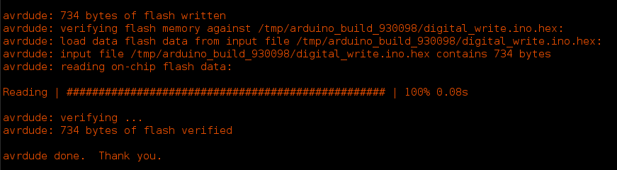
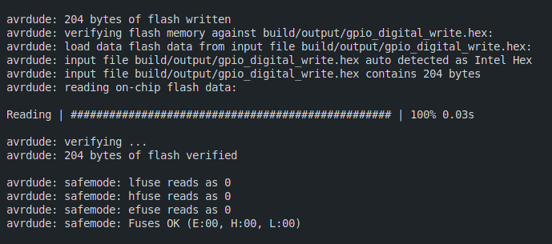

# GPIO Digital Write

This example demonstrates how to use the GPIO Digital Write block to write a digital value to a GPIO pin on an Arduino Uno (Atmega328p) using pure C programming without the Arduino libraries. The code utilizes the AVR-GCC toolchain for compilation and flashing the firmware onto the microcontroller.

## Project Structure

```
├── gpio_digital_write.c         # Main C source file
├── makefile                     # Makefile for building the project
└── README.md                    # Project documentation
```

## Prerequisites

- [AVR-GCC toolchain](https://gcc.gnu.org/wiki/avr-gcc)
- [avrdude](https://www.nongnu.org/avrdude/)
- Arduino Uno (Atmega328p)

## Code Overview (gpio_digital_write.c)

The code leverages direct register access to write a digital value to pin 13 (PORTB5) of the Arduino Uno. Let's break down the key components:

1. **Register Definitions**

    ```c
    #define PORTB *((volatile unsigned char *)0x25)
    #define DDRB *((volatile unsigned char *)0x24)
    ```

- We use preprocessor directives (`#define`) to create human-readable aliases for memory-mapped registers of the Atmega328P.


2. **Main Function (`main`)**

    ```c
    int main(void)
    {
        DDRB |= (1 << PINNUMBER); // Set PINNUMBER as output DDRB = DDRB | 0b00100000
        PORTB |= (1 << PINNUMBER); // Set PINNUMBER high PORTB = PORTB | 0b00100000
        PORTB &= ~(1 << PINNUMBER); // Set PINNUMBER low PORTB = PORTB & 0b11011111
        return 0;
    }
    ```

- `DDRB |= (1 << PINNUMBER);` sets the PINNUMBER as an output pin.          
- `PORTB |= (1 << PINNUMBER);` sets the PINNUMBER high.
- `PORTB &= ~(1 << PINNUMBER);` sets the PINNUMBER low.

## Building and Flashing the Project

1. Clone the repository and navigate to the project directory.

- Connect your Arduino Uno to your computer.
- Navigate to the project directory.
- Run the following command to build and flash the project
  ```bash
    make all
    ```

## Comparing the Code with Arduino IDE

The code in `gpio_digital_write.c` is equivalent to the following Arduino sketch:

```cpp
void setup() {
 pinMode(13,OUTPUT);
 digitalWrite(13,HIGH);
 digitalWrite(13,LOW);
}

void loop() {

}
```

However, when compiled and flashed using the Arduino IDE, it shows `734 bytes` has been written to the flash memory. But when compiled and flashed using the AVR-GCC toolchain, it shows `204 bytes` has been written to the flash memory. This demonstrates the efficiency of writing code in pure C without relying on the Arduino libraries.

### Arduino IDE Flash Memory Usage


### AVR-GCC Flash Memory Usage


## Conclusion

This project demonstrates how to write a digital value to a GPIO pin on an Arduino Uno using pure C programming. By directly accessing the memory-mapped registers, we can control the state of the GPIO pins without relying on the Arduino libraries. This approach provides a deeper understanding of the hardware and allows for more efficient code execution.

## References

- [Atmega328P Datasheet](https://ww1.microchip.com/downloads/en/DeviceDoc/ATmega48A-PA-88A-PA-168A-PA-328-P-DS-DS40002061A.pdf)
- [YouTube Video Tutorial](https://www.youtube.com/playlist?list=PLNyfXcjhOAwOF-7S-ZoW2wuQ6Y-4hfjMR)


## Author
- [Yasantha Niroshan](https://yasantha.me/)