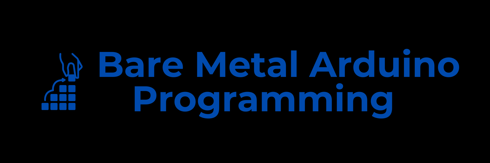

# Bare Metal Arduino Uno (Atmega328p) Programming in C

This repository provides a hands-on introduction to bare metal programming on the Arduino Uno (Atmega328p) using pure C and the AVR-GCC toolchain. Ditch the Arduino libraries and dive deep into direct register manipulation and timer interrupts to gain a profound understanding of the microcontroller's inner workings.

## Why Bare Metal Programming?

Bare metal programming empowers you to interact directly with the microcontroller's hardware, bypassing high-level abstractions like the Arduino libraries. This offers:

- **Enhanced Control:** Precisely manipulate registers, timers, interrupts, and peripherals for customized functionality.
- **Optimized Performance:** Eliminate library overhead for faster and more efficient code execution.
- **Deeper Understanding:** Gain invaluable insights into the microcontroller's architecture and low-level operations.

## Repository Content

The repository is structured into several self-contained examples, each illustrating a fundamental concept in bare metal programming:

- **GPIODigitalWrite:** Set pin 13 HIGH and LOW using direct register manipulation.
- **[Blynk](Blynk/Readme.md):**  Blink an LED connected to pin 13 using Timer1 interrupts.

## Getting Started

1. **Prerequisites:**
   - **AVR-GCC Toolchain**  
   The heart of your development environment. Download and install it from [https://gcc.gnu.org/wiki/avr-gcc](https://gcc.gnu.org/wiki/avr-gcc).
   - **avrdude** 
    The tool for flashing your code onto the Arduino Uno.  Obtain it from [https://www.nongnu.org/avrdude/](https://www.nongnu.org/avrdude/).
   - **Arduino Uno** 

   The target microcontroller board.
   - **Text Editor** Your weapon of choice for writing C code.
   - **Basic C Knowledge** Familiarity with C syntax and concepts is essential.

2. **Exploring the Examples**
   - Navigate into each example directory (e.g., `Blynk`).
   - **README.md:** Start by reading the README file for a detailed explanation of the example's purpose, code breakdown, and instructions.
   - **Source Code (e.g., `blynk.c`):** Examine the source code to see the bare metal implementation in action.
   - **Makefile:** The makefile automates the build and flash process.

3. **Building and Flashing:**
   - Connect your Arduino Uno to your computer.
   - Open a terminal and navigate to the example directory.
   - Execute the following command to build and flash the code: `make flsah`

## Resources

- **Atmega328P Datasheet** 
   - Your ultimate reference for understanding the microcontroller's registers, peripherals, and features 
   - [https://ww1.microchip.com/downloads/en/DeviceDoc/ATmega48A-PA-88A-PA-168A-PA-328-P-DS-DS40002061A.pdf](https://ww1.microchip.com/downloads/en/DeviceDoc/ATmega48A-PA-88A-PA-168A-PA-328-P-DS-DS40002061A.pdf)
- **AVR-GCC Tutorial** 
   - Dive deeper into using the AVR-GCC toolchain 
   - [https://www.nongnu.org/avr-libc/user-manual/](https://www.nongnu.org/avr-libc/user-manual/)
- **avrdude Guide** 
   - Get familiar with flashing code using avrdude
   - [https://www.nongnu.org/avrdude/user-manual/](https://www.nongnu.org/avrdude/user-manual/)
